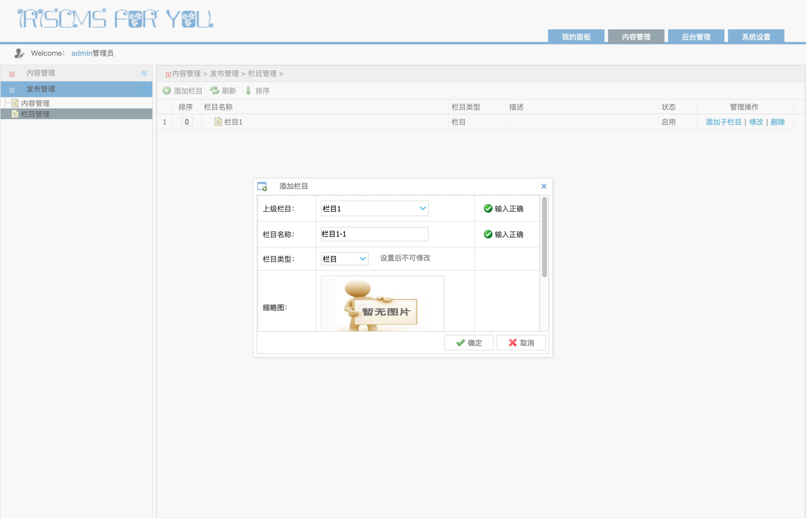
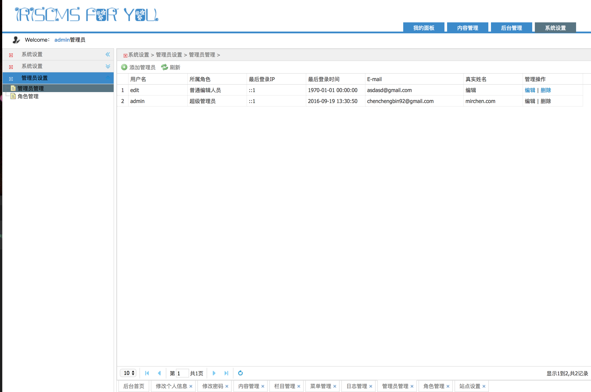

# 介绍 #
iriscms 一个基于`IrisGo`和`EasyUI`简单的cms框架吗,基础的后台管理功能,目前没有前台展示功能的实现.

# 下载部署 #

1. 下载源码
    > go get -u -v github.com/lazy007/iriscms

2. 数据库配置
    > 导入数据库结构`resources/iriscms.sql`

    > 修改`resources/configs/database.yml.dist`为`resources/configs/database.yml`

4. 安装依赖
    > glide i

5. 运行项目
    > ./main.exe or ./main

6. 开发期间热部署
    > go get -u -v github.com/pilu/fresh

    > fresh

7. 访问后端登陆页面
    > 访问 http://localhost:2017/b/login/index
    
    > 默认账号密码 `用户名: admin 密码: admin888`

8. 使用`Nginx`或者`Caddy`反向代理到`2017`端口即可

# 路由配置与实现 #
在`config/router.go`中按照已有配置实现相关的前后端路由,在控制器文件内务必实现`func (*XXController) BeforeActivation(b mvc.BeforeActivation)` 进行路由注册, 然后实现各个方法的功能与需求.

# TODO #
- [ ] error的错误日志
- [x] 网页缓存
- [ ] 存储驱动
- [ ] 基本框架
- [ ] 需要开放的公共权限设置
- [ ] SQL优化
- [ ] 添加bench 测试
- [ ] 打印 pprof 结果根据svg图形优化相关的代码
- [ ] groupcache 加入
- [ ] 图片裁切

# 后端页面预览 #

